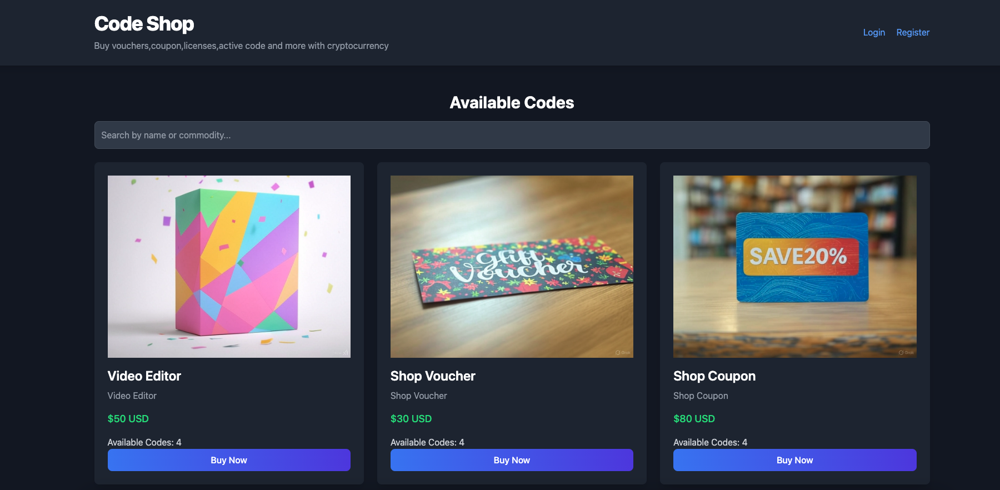
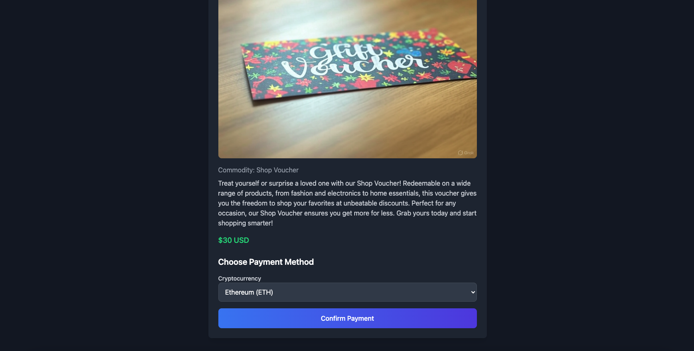
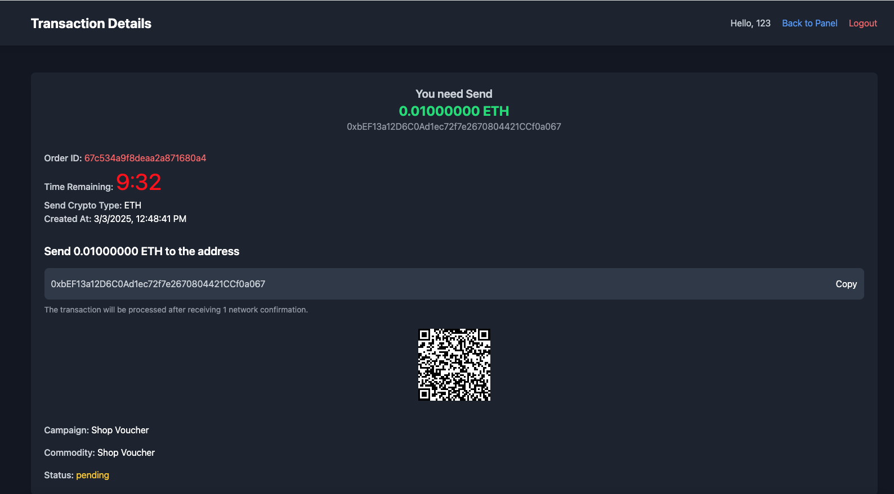
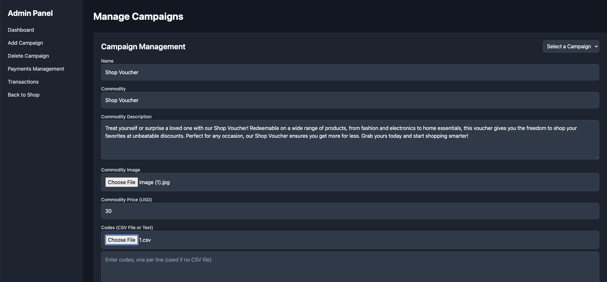
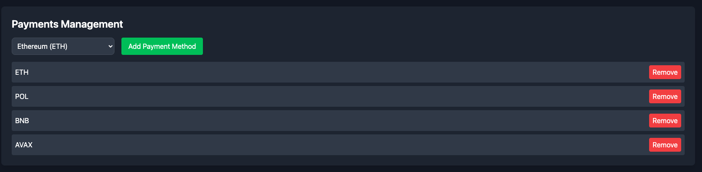

# Code-Shop
Sell vouchers,coupon,licenses,active code and more with cryptocurrency,Automatic delivery,Free,Open Source.

`npm install`

`change file.env to .env  then edit config of .env.`

`node v20 tested.`

`chmod -R 755 public/uploads` make sure this folder has write permission.

`node server.js` to run it.

 
 

 
